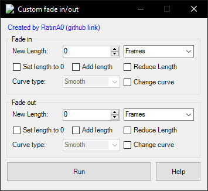

# Custom Fades
Vegas Pro script for adding fade in/out to selected media

### Info
You can set the Fade In/Out:
1. Length (in either Frames or Seconds)
  - If Length stays 0 -> it stays the same
  - Use the CheckBox if you want the Fade In/Out length to be 0
2. Curve Type (Fast, Linear, Sharp, Slow, Smooth)
  - It doesn't change the Curve Type by default
  - Use the CheckBox if you want to change it
  
Video: https://www.youtube.com/watch?v=eJtW4jLYJ8I

### Download
Releases: https://github.com/RatinA0/CustomFades/releases

`CustomFades13.dll` for SONY Vegas Pro 13 and below

`CustomFades14.dll` for MAGIX Vegas Pro 14 and above

### Run
Place the file in: `...\vegas install folder\Script Menu` or `...\Documents\Vegas Script Menu`

Run from Vegas: Tools -> Scripting -> Rescan Script Menu Folder -> Click the script

Add to the toolbar: Options -> Customize Toolbar

### Build
Import the correct reference:

Project -> Add reference -> Browse -> Your VEGAS install folder ->

- `ScriptPortal.Vegas.dll` for SONY Vegas Pro 13 and below

- `Sony.Vegas.dll` for MAGIX Vegas Pro 14 and above

### TODO
- [ ] Fix `System.IO.FileLoadException` & `System.NotSupportedExtension`
