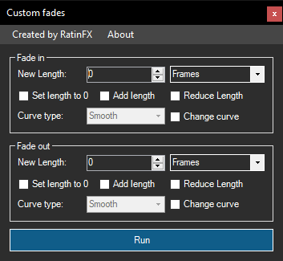

# Custom Fades
Vegas Pro script for adding fade in/out to selected media

## Video

https://www.youtube.com/watch?v=eJtW4jLYJ8I

## Overview

Quickly **Increase**, **Decrease** or **Set** the length of the **Fade in** or **Fade out** on the **selected Events**

You can select between **Frames** and **Seconds** to calculate the new lengths

Enable **Change curve** if you want to change the **Fade type** to:

- Fast
- Linear
- Sharp
- Slow
- Smooth

## How to use

1. Download "...13" or "...14" depending on your `VEGAS Pro version`
2. Find or create a folder called Vegas Script Menu inside your Documents folder like this:
    - `C:\Users\USER_NAME\Documents\Vegas Script Menu`
3. Place the .dll file, or Extract the contents of the .zip file into the folder above
4. Start VEGAS Pro and you can find the Script at `Tools - Scripting`

## Build

Import the correct reference:

Project -> Add reference -> Browse -> Your VEGAS install folder ->

- `ScriptPortal.Vegas.dll` for SONY Vegas Pro 13 and below

- `Sony.Vegas.dll` for MAGIX Vegas Pro 14 and above
